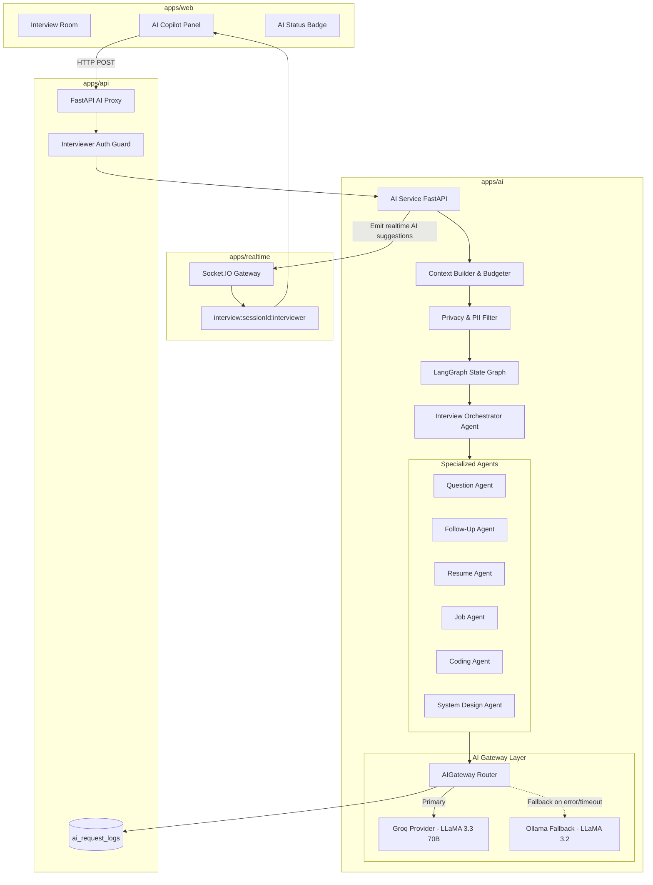

# Phase 12: AI Gateway & Multi-Agent Intelligence Foundation

## Architectural Overview

InterviewOS Phase 12 introduces an enterprise-grade AI Gateway and Multi-Agent Intelligence Foundation designed specifically for high-stakes technical interviews. The system provides real-time, deterministic assistance to interviewers while strictly preserving candidate fairness, multi-tenant isolation, and data privacy.

## Core Tenets

1. **Independent Service Architecture (`apps/ai`)**:
   - The AI service operates as a dedicated microservice with its own dependency stack (LangChain, LangGraph, Groq SDK, Ollama client).
   - The primary API service (`apps/api`) acts as a secure, tenant-verifying proxy and keeps its core footprint fast and light.

2. **Provider-Agnostic AI Gateway**:
   - Primary: **Groq** (`llama-3.3-70b-versatile` for high-depth reasoning, `llama-3.1-8b-instant` for low-latency tasks).
   - Fallback: **Ollama** (`llama3.2` local model), triggering seamlessly on network timeout, rate limit (HTTP 429), or service outage (HTTP 503).
   - Zero-leak fallback guarantees uptime even in air-gapped or disconnected environments.

3. **Multi-Agent Specialization**:
   - Orchestrator Agent: Routes tasks and coordinates multi-step context.
   - Question Generation Agent: Dynamically crafts stage-aware questions with full 4-tier rubrics.
   - Follow-Up Agent: Analyzes live candidate responses to generate targeted drill-down probes.
   - Resume Intelligence Agent: Identifies claims, flags, and creates verification questions.
   - Coding Analysis Agent: Examines candidate code complexity, smells, and generates hint ladders.
   - System Design Agent: Analyzes whiteboard architectures, detects SPOFs, and evaluates scaling tradeoffs.

4. **Security & Candidate Fairness**:
   - **Interviewer Only**: AI suggestions, insights, and telemetry are strictly restricted to interviewers.
   - Candidates are cryptographically blocked at the API Gateway, AI Service JWT claims validator, and Socket.IO rooms.
   - Socket events for AI are broadcast exclusively to `interview:${sessionId}:interviewer`.
